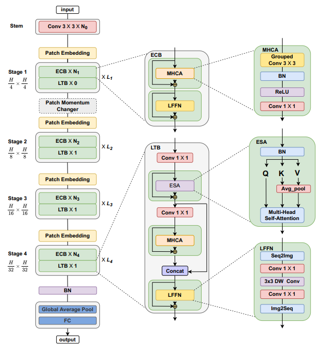

# MedViT-3D: A Robust Vision Transformer for Generalized 3D Medical Image Classification

This repo is the official implementation of MedViT-3D: A Robust Vision Transformer for Generalized 3D Medical Image Classification.

  
## Train & Test --- Prepare data
- (beginner friendly🍉) To train/evaluate MedViT on Cifar/Imagenet/CustomDataset follow ["CustomDataset"](https://github.com/Omid-Nejati/MedViT/blob/main/CustomDataset.md). 
- (New version) Updated the code ["Instructions.ipynb"](https://github.com/Omid-Nejati/MedViT/blob/main/Instructions.ipynb), added the installation requirements and adversarial robustness. 

## Introduction
Medical image classification is a critical step in medical image analysis. Convolutional Neural Networks (CNNs) have advanced existing medical systems for automatic disease diagnosis. The MedViT model presents a hybrid CNN-Transformer architecture optimized for 2D medical image classification [1]. This model does not work well with volumetric data and has a high computational requirement. The objective of this project is to overcome the two limitations by introducing MedViT-3D, a model that can classify volumetric 3D images such as CT scans, MRI, OCT etc, with high accuracy. To enhance generalizability, we propose a cross-modality transfer strategy where the model is trained on X-ray images and evaluated on MRI data. Our work aims to extend the model to support volumetric 3D data, enhance the performance of MedViT. 

Figure 1. Comparison between MedViTs and the baseline ResNets, in terms of average ACC-Parameters and average AUC-Parametrs trade-off over all 2D datasets.

## Overview

Figure 2. The overall hierarchical architecture of MedViT.

## ImageNet Pre-train
We provide a series of MedViT models pretrained on ILSVRC2012 ImageNet-1K dataset.

| Model      |   Dataset   | Resolution  | Acc@1 | ckpt   |  
|------------|:-----------:|:----------:|:--------:|:--------:|

## Visualization

Visual inspection of MedViT-T and ResNet-18 using Grad-CAM on MedMNIST-2D datasets. The green rectangles is
used to show a specific part of the image that contains information relevant to the diagnosis or analysis of a medical condition,
where the superiority of our proposed method can be clearly seen.

Figure 3. The heat maps of the output feature from ResNet and MedViT.

## Star History

## Acknowledgement
We heavily borrow the code from [RVT](https://github.com/vtddggg/Robust-Vision-Transformer) and [LocalViT](https://github.com/ofsoundof/LocalViT).

## Contact Information

